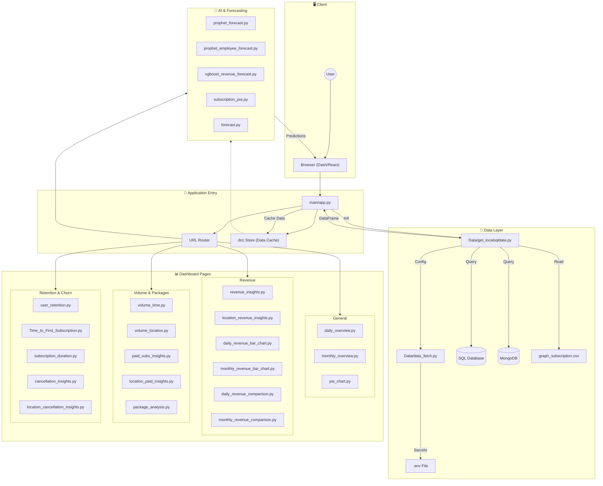

# Employer Subscription Portal

## 📋 Overview

The **Employer Subscription Portal** is a sophisticated analytics dashboard built with **Dash (Python)**. It is designed to provide real-time, deep insights into subscription metrics, revenue streams, user retention behavior, and AI-driven future forecasting using **XGBoost** and **Prophet**.

## 🏗️ Architecture Structure (Textual)

The application follows a modular architecture. Below is an exhaustive list of every component in the system and its specific role.

### **1. Data Access Layer (Model)**

*Responsible for connectivity, data fetching, and initial processing.*

- **`Data/__init__.py`**: Makes the Data directory a Python package.
- **`Data/get_localsqldata.py`**: The core data loader. Connects to SQL/Mongo, executes queries, and returns the primary Pandas DataFrame used by the app.
- **`Data/data_fetch.py`**: Handles environment variable loading (`os.getenv`) and constructs connection strings for MongoDB and SQL databases.
- **`Data/populate_local.py`**: A utility script used to populate the local database with sample or initial data for testing/development.
- **`Data/graph_subscription.csv`**: A static CSV dataset, likely used for fallback, testing, or specific graph initializations.

### **2. Application Logic Layer (Controller)**

*Manages the application lifecycle, routing, and global state.*

- **`main/__init__.py`**: Makes the main directory a Python package.
- **`main/app.py`**: The application entry point.
  - Initializes the `dash.Dash` app.
  - Defines the **Navigation Bar** and global layout.
  - implements the **Router** logic to switch views based on URL.
  - Registers the `dcc.Store` for client-side data caching.
  - Aggregates callbacks from all subscription pages.
- **`main/assets/`**: Directory containing static assets like CSS files (e.g., custom styles overriding Bootstrap) and images.

### **3. Presentation Layer (View - Subscription Pages)**

*Individual dashboards representing specific analytic verticals. Each file handles its own Layout and Callback registration.*

#### **General Overviews**

- **`daily_overview.py`**: High-level daily metrics (Total Active, New Subs Today, Revenue Today).
- **`monthly_overview.py`**: Aggregated monthly performance key performance indicators (KPIs).
- **`pie_chart.py`**: Distribution analysis (e.g., Subscription Types breakdown).

#### **Revenue Analytics**

- **`revenue_insights.py`**: Detailed time-series analysis of revenue growth.
- **`location_revenue_insights.py`**: Geospatial heatmap or breakdown of revenue by region/country.
- **`daily_revenue_bar_chart.py`**: Bar chart visualization of daily revenue figures.
- **`monthly_revenue_bar_chart.py`**: Bar chart visualization of monthly revenue figures.
- **`daily_revenue_comparison.py`**: Comparative analysis of revenue across different days.
- **`monthly_revenue_comparison.py`**: Year-over-Year or Month-over-Month revenue comparison.

#### **Volume & Subscription Counts**

- **`volume_time.py`**: Analysis of subscription volume trends over time.
- **`volume_location.py`**: Geographic distribution of subscription counts.
- **`paid_subs_insights.py`**: Analytics specifically focused on paid (non-trial) subscriptions.
- **`location_paid_insights.py`**: Location-based analysis of paid subscribers.
- **`package_analysis.py`**: Performance analysis of different subscription packages/tiers.

#### **Customer Success & Retention**

- **`user_retention.py`**: Cohort analysis and retention curves.
- **`Time_to_First_Subscription.py`**: Analysis of the conversion window (time from signup to purchase).
- **`subscription_duration.py`**: Analysis of average subscription lifetime.
- **`cancellation_insights.py`**: Analysis of churn reasons and cancellation trends over time.
- **`location_cancellation_insights.py`**: Geographic hotspots for cancellations.

### **4. AI & Forecasting Layer (Intelligence)**

*Advanced predictive modeling modules.*

- **`prophet_forecast.py`**: Uses Facebook Prophet to forecast general revenue trends.
- **`prophet_employee_forecast.py`**: predict future employee/user growth using Prophet.
- **`xgboost_revenue_forecast.py`**: Uses XGBoost regression to predict specific revenue streams (New vs. Renewed vs. Upgraded) based on temporal features.
- **`subscription_pre.py`**: (Likely "Prediction") A module for churn risk scoring or general subscription forecasting.
- **`forecast.py`**: A general forecasting utility or base module for the prediction logic.

---

## 🧜‍♀️ Detailed System Architecture Diagram (Mermaid)



---

## ⚙️ Environment Setup

You need to configure your database connections using a `.env` file.

1. **Locate the Example File**:
    The project includes a template file named `.env.example`.

2. **Create your Environment File**:
    Run the following command in your terminal to create your local `.env` file:

    **Windows (Command Prompt):**

    ```cmd
    copy .env.example .env
    ```

    **Windows (PowerShell) / Mac / Linux:**

    ```bash
    cp .env.example .env
    ```

3. **Edit Configuration**:
    Open the newly created `.env` file and fill in your actual credentials:

    ```ini
    MONGO_URI=mongodb://localhost:27017/
    MONGO_DB_NAME=your_db_name
    SQL_HOST=127.0.0.1
    SQL_USER=your_user
    SQL_PASSWORD=your_password
    ...
    ```

---

## 🚀 Running the Application

### Prerequisites

- Python 3.8+
- pip

### Option A: Running with Virtual Environment (Recommended)

#### **Windows**

1. Navigate to project root.
2. Create env: `python -m venv venv`
3. Activate: `.\venv\Scripts\activate`
4. Install: `pip install -r requirements.txt`
5. Run: `python main/app.py`
6. Browser: `http://127.0.0.1:8050/`

#### **Unix / macOS**

1. Navigate to project root.
2. Create env: `python3 -m venv venv`
3. Activate: `source venv/bin/activate`
4. Install: `pip install -r requirements.txt`
5. Run: `python main/app.py`
6. Browser: `http://127.0.0.1:8050/`

### Option B: Running Without Virtual Environment

1. Navigate to project root.
2. Install: `pip install -r requirements.txt`
3. Run: `python main/app.py`

---

## 📂 Exhaustive Project Structure

```text
EmployerSubscriptionPortal/
├── .env.example
├── .gitattributes
├── .gitignore
├── README.md
├── requirements.txt
├── testing.py
├── Data/
│   ├── __init__.py
│   ├── data_fetch.py
│   ├── get_localsqldata.py
│   ├── graph_subscription.csv
│   └── populate_local.py
├── main/
│   ├── __init__.py
│   ├── app.py
│   └── assets/
│       ├── (Static CSS/JS files)
├── subscription_pages/
│   ├── Time_to_First_Subscription.py
│   ├── __init__.py
│   ├── cancellation_insights.py
│   ├── daily_overview.py
│   ├── daily_revenue_bar_chart.py
│   ├── daily_revenue_comparison.py
│   ├── forecast.py
│   ├── location_cancellation_insights.py
│   ├── location_paid_insights.py
│   ├── location_revenue_insights.py
│   ├── monthly_overview.py
│   ├── monthly_revenue_bar_chart.py
│   ├── monthly_revenue_comparison.py
│   ├── package_analysis.py
│   ├── paid_subs_insights.py
│   ├── pie_chart.py
│   ├── prophet_employee_forecast.py
│   ├── prophet_forecast.py
│   ├── revenue_insights.py
│   ├── subscription_duration.py
│   ├── subscription_pre.py
│   ├── user_retention.py
│   ├── volume_location.py
│   ├── volume_time.py
│   └── xgboost_revenue_forecast.py
```
